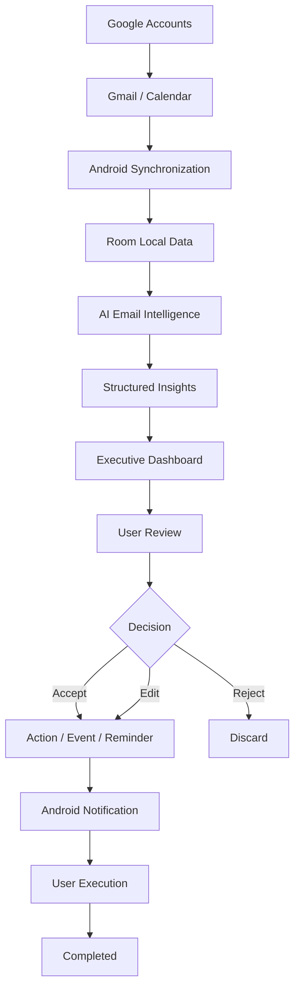
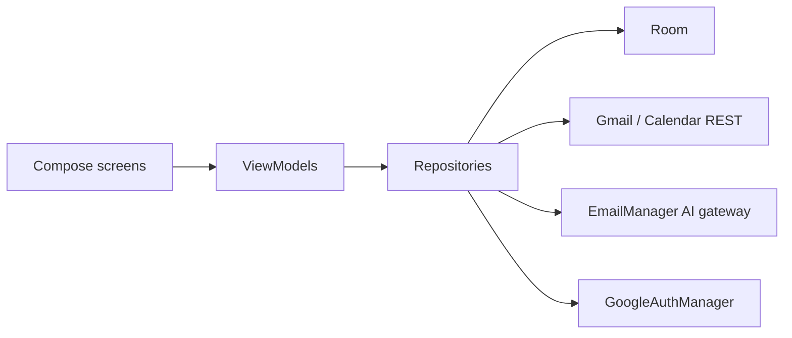

# Executive AI — Architecture

## Product flow

## Layers

- **UI**: one package per screen under `ui/screens/`, all Jetpack Compose + Material 3, reading
  state exclusively from a ViewModel's `StateFlow`. No networking/DB calls in Composables.
- **ViewModel**: one per screen (`viewmodel/`), exposes a single `UiState` data class per screen.
- **Repository** (`data/repository/`): owns one subsystem each — `AccountRepository`,
  `EmailRepository`, `InsightRepository`, `CalendarRepository`, `ExecutiveItemRepository`.
  This is also where Room and remote calls are coordinated; ViewModels never touch DAOs or
  Retrofit interfaces directly.
- **Local** (`data/local/`): Room entities/DAOs/`AppDatabase`.
- **Remote** (`data/remote/`): Retrofit interfaces + DTOs for the AI gateway, Gmail, and Calendar,
  each in their own sub-package, plus one shared `NetworkFactory`.
- **Auth** (`data/auth/`): `GoogleAuthManager`, wrapping the current (non-deprecated)
  `Identity.getAuthorizationClient` API for Gmail/Calendar scope grants.
- **DI** (`di/AppContainer.kt`): manual service locator — deliberately no Hilt/Dagger, see the
  file's doc comment for why.
- **Notification** (`notification/`): `AlarmManager`-based reminder scheduling foundation,
  survives reboot via `BootRescheduleReceiver` + WorkManager.
- **Voice** (`voice/`): native `android.speech.SpeechRecognizer` wrapper.

## The proposal state machine

Every event/action/deadline/reminder — whether extracted from an email by the AI or captured via
voice — enters as an `ExecutiveItem` in state `PROPOSED`. Only `ExecutiveItemRepository` may
transition it: `accept()` / `edit()` / `reject()` / `complete()`. Nothing becomes a real Android
alarm or Calendar event until `accept()` has been called by a user action in the UI — see
`RemindersViewModel.accept()` and `CalendarRepository.createEvent()` for the two places that
"Commitment → Execution" step is actually wired to a system side-effect.

## Multi-account model

`Account.id` is the Google account's email address — the same stable identifier used to key
Gmail/Calendar sync, so all downstream data (`EmailEntity.accountId`, etc.) can trace back to a
specific connected account. No OAuth token is ever persisted; `GoogleAuthManager.authorize()` is
called fresh (silently, once granted) whenever a repository needs a token, scoped to a specific
account via `AuthorizationRequest.setAccount(...)`.

## Known deviations / simplifications from REQUIREMENTS.md

- **Credential Manager vs. AuthorizationClient**: REQUIREMENTS.md points to the Android OAuth
  client ID in `strings.xml` as *the* auth mechanism. In the current Android identity
  architecture, that Android client ID (keyed to package name + SHA-1) is what
  `Identity.getAuthorizationClient` uses for scope grants — which is what this app is built on.
  A separate *web* OAuth client ID would additionally be needed only if a full Credential-Manager
  "Sign in with Google" (ID-token) flow is added later; it isn't needed for the Gmail/Calendar
  access this app actually performs, so it hasn't been added.
- **AI response contract**: modeled as a JSON array of per-email insight objects (the batch
  endpoint's natural shape for N emails in → N results out). If the live backend actually returns
  a different envelope (e.g. `{ "results": [...] }`), adjust `InsightResponseDto`/`AiInsightApi`
  accordingly — this should be confirmed against the real backend response.
